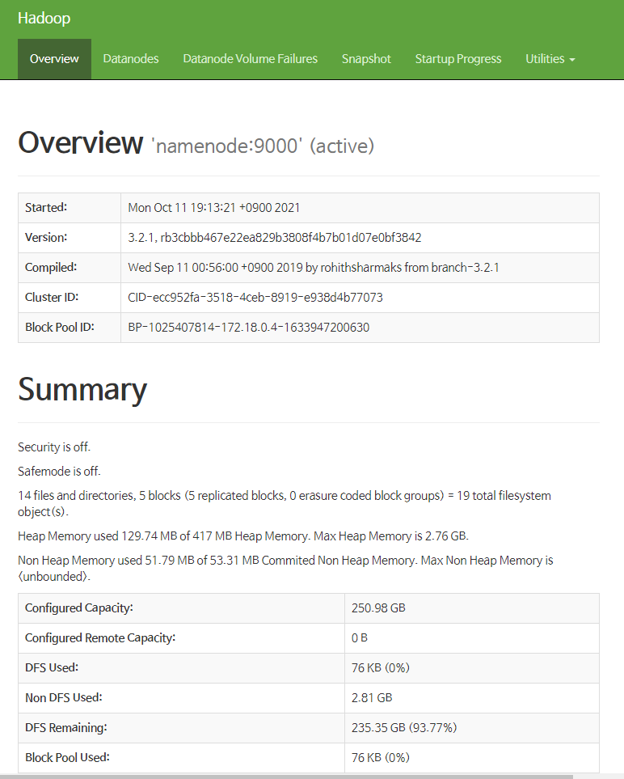

# 도커를 이용한 하둡 클러스터 만들기

## 도커 컴포즈를 이용한 복수의 컨테이너들 설치

- `git clone https://github.com/big-data-europe/docker-hadoop.git`으로 프로젝트 파일을 가져온다.
- `cd docker-hadoop`으로 이동한 후 `docker-compose up`으로 도커에서 복수의 컨테이너를 실행시킨다.
  - 도커 컴포즈는 도커에서 복수의 컨테이너를 실행시키는 툴이다. `docker-compose.yml`이라는 YAML 파일을 사용하여 어플리케이션의 서비스를 구성한다. `docker-compose up` 명령어를 실행하여 컴포즈를 실행시키고 전체 앱을 실행시킨다.
- `docker container ls`로 컨테이너들을 확인한다.

```
CONTAINER ID   IMAGE                                                    COMMAND                  CREATED          STATUS                    PORTS
                NAMES
b9fa2d4c7eb4   bde2020/hadoop-historyserver:2.0.0-hadoop3.2.1-java8     "/entrypoint.sh /run…"   13 minutes ago   Up 12 minutes (healthy)   8188/tcp
                historyserver
a9fbc41e1f45   bde2020/hadoop-resourcemanager:2.0.0-hadoop3.2.1-java8   "/entrypoint.sh /run…"   13 minutes ago   Up 12 minutes (healthy)   8088/tcp
                resourcemanager
9aee63cbdeb4   bde2020/hadoop-namenode:2.0.0-hadoop3.2.1-java8          "/entrypoint.sh /run…"   13 minutes ago   Up 12 minutes (healthy)   0.0.0.0:9000->9000/tcp, 0.0.0.0:9870->9870/tcp   namenode
ea79103308f0   bde2020/hadoop-nodemanager:2.0.0-hadoop3.2.1-java8       "/entrypoint.sh /run…"   13 minutes ago   Up 12 minutes (healthy)   8042/tcp
                nodemanager
0eee7d8613ca   bde2020/hadoop-datanode:2.0.0-hadoop3.2.1-java8          "/entrypoint.sh /run…"   13 minutes ago   Up 12 minutes (healthy)   9864/tcp
                datanode
```

- namenode(0.0.0.0:9000->9000, 0.0.0.0:9870->9870), datanode(9864), nodemanager(8042), resourcemanager(8088), historyserver(8188)를 확인할 수 있다.

## 네임노드 컨테이너 접속 및 디렉토리 생성 명령

- `docker exec -it namenode /bin/bash`로 네임노드에 들어간다.
  - `docker exec`는 container에 특정 명령을 실행시키라는 명령이고, 이때 실행시킬 명령이 /bin/bash이다.
  - `-it`는 STDIN 표준 입출력을 열고 가상 tty (pseudo-TTY) 를 통해 접속하겠다는 의미이다.
  - 네임노드 컨테이너에 접속 성공: `root@9aee63cbdeb4:/#`
- `hdfs dfs -ls /` 명령어를 사용하여 디렉토리를 확인한다.
  - 하둡 파일 시스템에서는 `hdfs dfs [일반적인 옵션] [커맨드 옵션]`으로 명령어를 내린다.
    - 예시) 로컬 파일을 hdfs에 저장한다: `-appendToFile`, 해당 파일의 그룹 권한을 변경한다: `-chmod`, hdfs의 파일을 로컬 디렉토리에 다운로드한다: `-copyToLocal`, hdfs 내부에서 파일을 복사하고 붙여넣기 한다: `-cp` 등
- `hdfs dfs -mkdir -p /user/root`로 디렉토리를 생성한다.
- `exit`로 접속을 종료한다.

## 이더넷(WSL) 접속

- `ipconfig`로 이더넷 어댑터(WSL)의 ipv4를 확인한다.
- 웹 브라우저로 해당 ip의 :9870 포트로 접속한다.
- 다음과 같은 화면이 나오면 성공적으로 접속한 것이다.
  

## jar 파일을 다운 및 네임노드 컨테이너에 복사하기

- `wget https://repo1.maven.org/maven2/org/apache/hadoop/hadoop-mapreduce-examples/2.7.1/hadoop-mapreduce-examples-2.7.1-sources.jar`로 파일 다운로드(리눅스)
- `docker cp hadoop-mapreduce-examples-2.7.1-sources.jar namenode:/tmp/`로 로컬에서 컨테이너로 파일을 복제한다.
- 테스트에 사용할 `input1.txt`를 만든 뒤 `docker cp input1.txt namenode:/tmp/`로 복제한다.

## hdfs에 파일 업로드

- `docker exec -it namenode /bin/bash`로 다시 네임노드 컨테이너에 명령어를 수행한다.
- `cd /tmp/`로 이동 후, `cat input1.txt`로 확인하면 해당 파일이 복제된 것을 확인할 수 있다.
- input1.txt 파일을 hdfs로 업로드 하기 위해 `hdfs dfs -mkdir /user/root/input` 명령어로 hdfs에 디렉토리를 만든다.
- `hdfs dfs -put input1.txt /user/root/input/`로 input1.txt 파일을 hdfs에 업로드 한다.
- 역시 `hdfs dfs -cat /user/root/input/input1.txt`로 확인할 수 있다.

## 맵리듀스 작업 실행하기

- hadoop jar 커맨드로 맵리듀스 jar 파일을 실행하고 클래스 파일을 불러온다. 만들어 놓은 input 디렉토리를 사용하고 output 디렉토리를 생성한다. : `hadoop jar hadoop-mapreduce-examples-2.7.1-sources.jar org.apache.hadoop.examples.WordCount input output`
- 다음과 같은 명령어가 출력되면 성공적으로 맵리듀스 작업을 실행한 것이다.

```
2021-10-11 12:01:05,955 INFO client.RMProxy: Connecting to ResourceManager at resourcemanager/172.18.0.3:8032
2021-10-11 12:01:06,091 INFO client.AHSProxy: Connecting to Application History server at historyserver/172.18.0.6:10200
2021-10-11 12:01:06,242 INFO mapreduce.JobResourceUploader: Disabling Erasure Coding for path: /tmp/hadoop-yarn/staging/root/.staging/job_1633947212148_0001
2021-10-11 12:01:06,321 INFO sasl.SaslDataTransferClient: SASL encryption trust check: localHostTrusted = false, remoteHostTrusted = false
2021-10-11 12:01:06,412 INFO input.FileInputFormat: Total input files to process : 1
2021-10-11 12:01:06,434 INFO sasl.SaslDataTransferClient: SASL encryption trust check: localHostTrusted = false, remoteHostTrusted = false
2021-10-11 12:01:06,451 INFO sasl.SaslDataTransferClient: SASL encryption trust check: localHostTrusted = false, remoteHostTrusted = false
2021-10-11 12:01:06,458 INFO mapreduce.JobSubmitter: number of splits:1
2021-10-11 12:01:06,543 INFO sasl.SaslDataTransferClient: SASL encryption trust check: localHostTrusted = false, remoteHostTrusted = false
2021-10-11 12:01:06,556 INFO mapreduce.JobSubmitter: Submitting tokens for job: job_1633947212148_0001
2021-10-11 12:01:06,556 INFO mapreduce.JobSubmitter: Executing with tokens: []
2021-10-11 12:01:06,698 INFO conf.Configuration: resource-types.xml not found
2021-10-11 12:01:06,698 INFO resource.ResourceUtils: Unable to find 'resource-types.xml'.
2021-10-11 12:01:07,094 INFO impl.YarnClientImpl: Submitted application application_1633947212148_0001
2021-10-11 12:01:07,127 INFO mapreduce.Job: The url to track the job: http://resourcemanager:8088/proxy/application_1633947212148_0001/
2021-10-11 12:01:07,127 INFO mapreduce.Job: Running job: job_1633947212148_0001
2021-10-11 12:01:13,200 INFO mapreduce.Job: Job job_1633947212148_0001 running in uber mode : false
2021-10-11 12:01:13,201 INFO mapreduce.Job:  map 0% reduce 0%
2021-10-11 12:01:18,246 INFO mapreduce.Job:  map 100% reduce 0%
2021-10-11 12:01:22,279 INFO mapreduce.Job:  map 100% reduce 100%
2021-10-11 12:01:22,292 INFO mapreduce.Job: Job job_1633947212148_0001 completed successfully
2021-10-11 12:01:22,361 INFO mapreduce.Job: Counters: 54
        File System Counters
                FILE: Number of bytes read=100
                FILE: Number of bytes written=458745
                FILE: Number of read operations=0
                FILE: Number of large read operations=0
                FILE: Number of write operations=0
                HDFS: Number of bytes read=190
                HDFS: Number of bytes written=76
                HDFS: Number of read operations=8
                HDFS: Number of large read operations=0
                HDFS: Number of write operations=2
                HDFS: Number of bytes read erasure-coded=0
        Job Counters
                Launched map tasks=1
                Launched reduce tasks=1
                Rack-local map tasks=1
                Total time spent by all maps in occupied slots (ms)=6436
                Total time spent by all reduces in occupied slots (ms)=13056
                Total time spent by all map tasks (ms)=1609
                Total time spent by all reduce tasks (ms)=1632
                Total vcore-milliseconds taken by all map tasks=1609
                Total vcore-milliseconds taken by all reduce tasks=1632
                Total megabyte-milliseconds taken by all map tasks=6590464
                Total megabyte-milliseconds taken by all reduce tasks=13369344
        Map-Reduce Framework
                Map input records=3
                Map output records=13
                Map output bytes=128
                Map output materialized bytes=92
                Input split bytes=112
                Combine input records=13
                Combine output records=10
                Reduce input groups=10
                Reduce shuffle bytes=92
                Reduce input records=10
                Reduce output records=10
                Spilled Records=20
                Shuffled Maps =1
                Failed Shuffles=0
                Merged Map outputs=1
                GC time elapsed (ms)=71
                CPU time spent (ms)=720
                Physical memory (bytes) snapshot=548495360
                Virtual memory (bytes) snapshot=13576130560
                Total committed heap usage (bytes)=489684992
                Peak Map Physical memory (bytes)=318685184
                Peak Map Virtual memory (bytes)=5113307136
                Peak Reduce Physical memory (bytes)=229810176
                Peak Reduce Virtual memory (bytes)=8462823424
        Shuffle Errors
                BAD_ID=0
                CONNECTION=0
                IO_ERROR=0
                WRONG_LENGTH=0
                WRONG_MAP=0
                WRONG_REDUCE=0
        File Input Format Counters
                Bytes Read=78
        File Output Format Counters
                Bytes Written=76
```

- exit로 네임노드 컨테이너에서 접속을 종료한다.

## 도커 컴포즈로 컨테이너 종료

- `docker-compose down`으로 모든 컨테이너를 종료할 수 있다.

```
[+] Running 6/6
 - Container historyserver        Removed                                                                                                    11.6s
 - Container namenode             Removed                                                                                                    12.2s
 - Container datanode             Removed                                                                                                    12.1s
 - Container resourcemanager      Removed                                                                                                    11.9s
 - Container nodemanager          Removed                                                                                                    11.6s
 - Network docker-hadoop_default  Removed                                                                                                     0.6s
```

- `docker container ls`로 확인해보면 모든 컨테이너가 종료되었다.

# 도커 바인드 마운트

## 개요

- 도커 컨테이너에 쓰여진 데이터는 기본적으로 컨테이너가 삭제될 때 사라지게 된다. 따라서 컨테이너의 생명 주기와 관련없이 데이터를 영속적으로 저장하고, 여러 개의 컨테이너가 공유할 저장 공간이 필요하게 된다.
- 도커는 이를 위해 1. 볼륨과 2. 바인드 마운트를 제공한다. 볼륨과 바인드 마운트의 가장 큰 차이점은 도커가 해당 마운트 포인트를 관리해주는지 안해주는지의 차이이다. 볼륨을 사용할 때는 개발자가 직접 볼륨을 생성하거나 삭제해야하지만, 해당 볼륨을 도커 상에서 관리가 되는 이점이 있다.

## index.html 파일 바인드 마운트 하기

- `docker pull nginx`로 nginx 이미지를 다운 받는다.
- `cd bind-mount`로 이동한다.
- 컨테이너로 마운트 하기 위하여 호스트에 `mkdir -p /tmp/nginx/html` 명령어로 디렉토리를 만든다.
- `docker run -t -d -P -v /tmp/nginx/html:/usr/share/nginx/html --name nginxcontainer nginx:latest`
  - `-d`는 detachable 모드에서 실행을 의미한다. 컨테이너에가 백그라운드에서 실행되며 실행 결과로 컨테이너 ID만을 출력한다. 터미널에서 빠져나와도 해당 컨테이너가 종료되지 않는다.
  - `-it`는 컨테이너를 종료하지 않은 채로 터미널의 입력을 계속해서 컨테이너로 전달하기 위해서 사용한다.
  - `--name` 옵션으로 컨테이너에 이름을 부여한다.
  - `-p` 옵션으로 호스트와 컨테이너 간의 포트 배포/바인드를 한다.
  - `-v` 옵션은 호스트와 컨테이너 간의 볼륨을 설정한다. 호스트 컴퓨터 파일 시스템의 특정 결로를 컨테이너 파일 시스템의 특정 경로로 마운트 한다.
- `docker container ls`로 확인한다.

```
CONTAINER ID   IMAGE          COMMAND                  CREATED          STATUS          PORTS                   NAMES
4fe26cbad64c   nginx:latest   "/docker-entrypoint.…"   16 seconds ago   Up 15 seconds   0.0.0.0:49153->80/tcp   nginxcontainer
```

- `ipconfig`로 ip주소를 확인하고 앞서 확인한 포트 넘버를 더해 웹으로 접속해보면 아직은 403 Forbidden 화면이 나온다. 아직 컨테이너에 html 파일이 없으므로 당연한 결과이다.
- index.html 파일을 `/tmp/nginx/html`에 만들고 수정하면 해당 파일이 연동된 것을 확인할 수 있다.
- `docker inspect 4fe26cbad64c`로 "Mounts"의 이미지를 확인할 수 있다.

# 도커 하이브

- `mkdir docker-hive`로 생성 `cd docker-hive`로 이동 후 `git clone https://github.com/big-data-europe/docker-hive.git`로 해당 파일 다운로드한다.
- `ls`로 `docker-compose.yml` 파일 등을 확인하면 여러 서비스(namenode, datanode, hive-server 등)에 대응되는 컨테이너들을 확인할 수 있다.
- `docker-compose up -d`로 이미지들을 다운로드하고 컨테이너들을 다운로드 한다. `docker container ls`로 모두 업 되고 러닝되는 것을 확인한다.

```
CONTAINER ID   IMAGE                                                    COMMAND                  CREATED              STATUS                        PORTS
                        NAMES
2a90c7220b94   bde2020/hadoop-nodemanager:2.0.0-hadoop3.2.1-java8       "/entrypoint.sh /run…"   About a minute ago   Up About a minute (healthy)   8042/tcp
                        nodemanager
470340b10ef9   bde2020/hadoop-historyserver:2.0.0-hadoop3.2.1-java8     "/entrypoint.sh /run…"   About a minute ago   Up About a minute (healthy)   8188/tcp
                        historyserver
43c519dca253   bde2020/hadoop-resourcemanager:2.0.0-hadoop3.2.1-java8   "/entrypoint.sh /run…"   About a minute ago   Up 41 seconds (healthy)       8088/tcp
                        resourcemanager
4d4c2b768c85   bde2020/hadoop-namenode:2.0.0-hadoop3.2.1-java8          "/entrypoint.sh /run…"   About a minute ago   Up About a minute (healthy)   0.0.0.0:9000->9000/tcp, 0.0.0.0:9870->9870/tcp   namenode
addd9382864c   bde2020/hadoop-datanode:2.0.0-hadoop3.2.1-java8          "/entrypoint.sh /run…"   About a minute ago   Up About a minute (healthy)   9864/tcp
                        datanode
```

- `docker-compose exec hive-server bash`로 하이브 서버에 컨테이너에 접속한다.
- `/opt/hive/beeline -u jdbc:hive2://localhost:10000` 명령어로 db를 조작하기 시작한다.
- `show databases ;`로 보면 db가 없으므로 `create database training ;`로 만들고 `use training ;`로 db를 만든 뒤에 `create table fruits (name string, price int) ;` 로 테이블을 만든다. `show tables;`와 `describe fruits ;`로 확인한다.
- `describe formatted fruits ;` 명령어로 데이터의 위치를 파악할 수 있다:

```
Location: hdfs://namenode:8020/user/hive/warehouse/training.db/fruits
```

- `!quit` 명령어로 hive를 종료하고 `exit`로 컨테이너로 부터 나온다.
- `docker compose down`으로 컨테이너를 종료한다.

# 도커 카프카

- 각기 다른 포트로 3개의 주키퍼와 카프카 서비스를 동작시키는 docker-compose.yml 파일을 작성한다.
- 도커허브의 confluentinc/cp-kafka 이미지를 사용한다.
- `docker-compose up -d` 명령어로 detachable 모드로 실행한다.
- `docker container ls`로 확인할 수 있다.
- `telnet localhost 12181`, `telnet localhost 22181`, `telnet localhost 32181`, `telnet localhost 19092`
- `docker-compose down`으로 종료한다.
